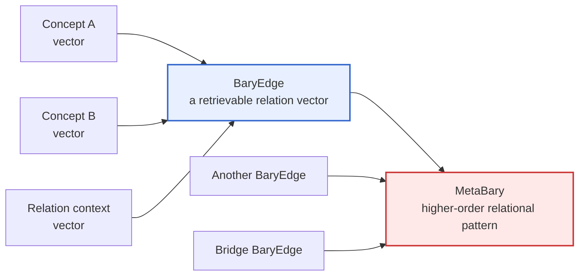
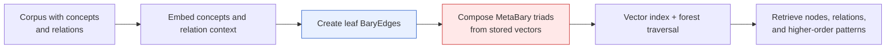

# BaryGraph

[](https://doi.org/10.5281/zenodo.20186500)

> **BaryGraph turns relationships into searchable objects.**
> It is a graph-and-vector architecture for finding useful conceptual coordinates: not only *what is near a query*, but *what relation might connect two otherwise distant regions of a semantic space*.

Most retrieval systems return an answer, a document, or a neighbor. BaryGraph is built for a different moment: when a researcher, writer, agent, or tool needs a **productive unfamiliar adjacency** - a connection that is not yet a conclusion, but gives thinking somewhere new to go.

A model testing the Kaikki proof of concept described this role well: BaryGraph behaves less like an answer engine than an **associative atlas**. Another called it a "de-cliche device." These are not benchmark claims. They are descriptions of an interaction pattern: the system supplies a surprising coordinate; the user or model must still interpret, test, reject, or develop it.

## The idea in one minute

In an ordinary knowledge graph, nodes are usually the first-class objects and edges are lightweight annotations. In an ordinary vector index, documents have vectors but their relationships often remain implicit in text.

BaryGraph makes the relation itself a first-class vector object, called a **BaryEdge**.

- Two concepts are the children of a BaryEdge.
- The BaryEdge receives its own stored vector: a weighted, normalized composition of the child vectors and relation context.
- BaryEdges can become children of higher-order relational objects (**MetaBary** triads).
- Those triads can recurse upward, producing a forest of increasingly abstract relational patterns.
- All of these objects can be retrieved with nearest-neighbor search.

The name borrows from the barycenter in physics: the shared center generated by two bodies is treated as a real location with properties of its own. BaryGraph applies the same intuition to semantic relations.



At the leaf level, a simplified construction is:

$$
\mathbf{v}_{\text{edge}} = \text{normalize}\!\left(q\,\mathbf{v}_1 + q\,\mathbf{v}_2 + (1-q)\,\mathbf{v}_{\text{context}}\right)
$$

At higher levels, construction is algebra on vectors already stored in the graph. No new embedding call is required for every recursive step.

## Why this is different

BaryGraph does not claim that a retrieved bridge is true, causal, or explanatory. Its core contribution is more modest and potentially more useful:

> **It makes relations, and relations between relations, addressable in the same semantic space as the concepts themselves.**

This creates a retrieval surface that flat document search does not naturally provide.

| Flat vector retrieval | BaryGraph retrieval |
|---|---|
| Finds text or concepts near a query | Finds concepts, relations, and higher-order relation patterns |
| Similarity is mostly attached to documents | Similarity can be attached to the relationship between documents |
| Strong for direct relevance | Designed to surface bridges and intermediate structure |
| Often returns the familiar neighborhood | Can expose an unfamiliar but inspectable coordinate |

The point is not to replace evidence-based search, reasoning, or domain expertise. A BaryGraph result is a **prompt for investigation**, not a proof.

## What it can be used for

### 1. Cross-domain research and hypothesis generation

A query may begin in one discipline and return a relational pattern whose useful interpretation sits elsewhere. This can help researchers identify analogies worth checking, shared mechanisms worth formalizing, or vocabulary they would not have searched for directly.

**Example question:**

> What do coral reefs, legal precedent, and error-correcting codes reveal about resilience through redundancy?

A useful reading of the returned neighborhood was that redundancy has different forms across ecology, law, and communication, but a shared functional core:

$$
\text{resilience} \approx \text{continued function under partial loss}
$$

A weak bridge, "turn on," suggested a further hypothesis: protective redundancy is often latent until failure activates it. That is not an answer supplied by the graph. It is a testable interpretation produced from the graph's coordinate.

### 2. Lateral ideation for writing, design, and strategy

BaryGraph can deliberately provide resistance to the first, most cliched continuation. Rather than asking a model to invent a metaphor from scratch, retrieve a strange but grounded relational neighborhood and ask the model to account for it.

**Example question:**

> How can a community treat uncertainty as material for designing resilient rituals, institutions, or shared decisions?

A surprising bridge linked community language with temporary microbiome modulation. Taken as analogy rather than evidence, it suggested a practical design principle: under uncertainty, a community can run small, reversible interventions that change conditions and teach the system what it can sustain, instead of immediately committing to a permanent institution.

### 3. Agentic systems that need more than agreement

Language models are optimized to produce plausible continuations. That makes them useful, but it can also make their first response too smooth, too local, or too conventional.

BaryGraph can act as an external source of semantic resistance: it gives an agent a relation it did not generate itself, then asks it to justify, operationalize, or discard the connection.

In that sense, BaryGraph is not simply a knowledge base for humans. It can be a **coordinate system for models** - a structured source of alternatives that is neither a supervisor nor an answer key.

### 4. Exploring a corpus as relational terrain

The current proof of concept uses the English Kaikki/Wiktionary corpus because its relations are already labeled, results remain human-readable, and the corpus offers a useful ground-truth substrate. The architecture itself is corpus-agnostic.

Possible future substrates include:

- scientific literature and citation contexts;
- software repositories, APIs, and issue histories;
- legal cases, holdings, and precedent networks;
- clinical or biological ontologies, with appropriate validation and governance;
- product, operational, or institutional knowledge bases.

Each application needs its own evaluation. A compelling semantic bridge is not sufficient evidence for scientific, clinical, legal, or operational decisions.

## Examples from the Kaikki proof of concept

The examples below illustrate the intended behavior. They are not claims that the graph has discovered new facts.

### Measure between ritual and number

A probe around boredom, ritual, and counting returned a bridge including terms such as `mensural`, `metrical`, `cadenced`, `foot-tapping`, and `time step` between ritual-related nodes.

The productive interpretation was not "boredom causes mathematics." It was a more precise question:

> Could undifferentiated time create an impulse to impose measure, with ritual and number as bodily and symbolic exports of that measure?

The graph supplied the unexpected hinge: **meter**. A person or model remains responsible for deciding whether that hinge is historically, cognitively, or artistically defensible.

### Redundancy as latent resilience

A probe spanning coral reefs, legal precedent, and error-correcting codes converged on several senses of redundancy: ecological functional overlap, duplicate components, repeated message structure, and legally removable surplus.

This made a useful distinction visible:

$$
\text{useful redundancy} = \text{multiplicity} + \text{failure independence}
$$

The distinction matters. Repetition that fails in the same way can be dead weight; diverse alternatives that fail independently can preserve a system's function.

### Networks across biological and digital substrates

A probe on mycelial networks and internet architecture surfaced `anastomose` / `anastomosis` alongside network-topology and interconnect terms. The result does not establish that fungi and networks are the same thing. It provides a precise vocabulary for asking which topological properties may be substrate-independent: cross-links, alternate routes, distributed repair, or resilience to local failure.

### The value of a bad edge

Noisy edges are expected. Sometimes they are simply artifacts. Sometimes they are the most productive prompts in the result set.

For example, a contradiction between an "inactigram" (a record of not-doing) and `memory / blank` led to the thought that **recorded inactivity is no longer blank**. From there come questions about tally marks, calendars, rosaries, logs, and the ways a community turns absence into a countable object.

The discipline is simple: label the bridge as a prompt, not a fact. Then try to explain it away or make it rigorous. Either route can be informative.

## Current proof of concept

The Kaikki English build currently contains approximately **6.66 million documents**:

- 1.74M sense nodes;
- 1.44M word nodes;
- 2.50M leaf-level BaryEdges;
- approximately 989k MetaBary triads across levels L13 through L10.

It demonstrates that a large relational forest can be built locally and queried as a vector index. It does **not** establish general reasoning ability, causal discovery, or cross-domain truth.

For architecture, equations, pipeline details, evaluation notes, and limitations, see:

- [Kaikki PoC specification](BaryGraph_Kaikki_PoC_v0_6.md)
- [Zenodo pilot paper](BaryGraph_Zenodo_Pilot_v1_2.md)

## How to think about results

A good BaryGraph workflow has two phases:

1. **Retrieve a coordinate.** Ask an open question and inspect nodes, BaryEdges, MetaBary structure, parent chains, and apparently weak bridges.
2. **Do the real work.** Use domain knowledge, sources, experiments, formal models, or human judgment to assess what the coordinate is worth.

Use BaryGraph when you want a well-formed question, an unfamiliar adjacency, or a non-obvious intermediate concept. Do not use it alone when you need a verified fact, a causal conclusion, or a high-stakes recommendation.

## How it works

At the base level, BaryGraph ingests corpus concepts and their available relations. It embeds the relevant objects, creates BaryEdges, and indexes both nodes and edges. It then recursively builds MetaBary triads from stored relational vectors.



The technical specification defines the exact vector equations, edge types, hierarchy mapping, weight propagation, indexing, construction stages, and known limitations.

## Run the Kaikki proof of concept

Requirements: Python 3.11+ and Docker.

```bash
# Install dependencies
pip install -r requirements.txt

# Start the project-owned MongoDB service on port 27117
docker compose up -d

# Download the Kaikki English dump (idempotent and resumable)
make download

# Check the environment
make preflight

# Run ingestion and graph construction
make pipeline
```

For stage-by-stage commands, environment configuration, and query patterns, see the [Kaikki PoC specification](BaryGraph_Kaikki_PoC_v0_6.md).

## Status and invitation

BaryGraph is an experimental architecture and the Kaikki build is a proof of concept. The most interesting next step is not a grand claim; it is adversarial use:

- try it on a corpus you understand;
- bring questions that cross domains;
- inspect where the graph merely echoes a keyword;
- keep the bridges that produce better questions;
- reject the ones that do not survive contact with evidence.

If you would like to build locally, test it with your own models, or discuss a public GitHub repository, please open an issue or get in touch.

## Citation

If you use or discuss this work, please cite the Zenodo record:

```text
BaryGraph: Relationships as First-Class Vectors for Cross-Domain Retrieval.
Zenodo. https://doi.org/10.5281/zenodo.20186500
```

## License

Code is released under the [Apache License, Version 2.0](LICENSE).

Dictionary content originates from English Wiktionary via kaikki.org and
carries its licenses (CC BY-SA; GFDL where applicable) — see [NOTICE](NOTICE).
Signed model testimony in the graph reflects its authors' views, not this
project's.
